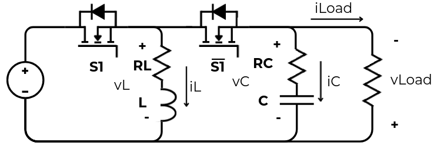
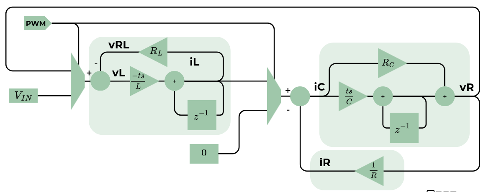

# Buck-Boost (level2)

Level 2 Buck-Boost converter model.

## Electrical circuit



## Block diagram



## Module in/out

### Parameters

|Parameter|Definition|
|-|-|
|`data_width`| IN/OUT/Internal data width |
|`data_width_decimal`| IN/OUT/Internal decimal data width |

### Input

|Input|Definition|
|-|-|
|`aclk`|Clock input|
|`resetn`|Asynchronous negated reset|
|`ce`| Clock enable of the model|
|`s1`| Switch element control|
|`kL`| Inductor constant |
|`kC`| Capacitor constant |
|`kR`| Load resistor constant |
|`vdc`| Input voltage |

### Output

|Output|Definition|
|-|-|
|`iL`| Inductor current |
|`vL`| Inductor voltage |
|`iC`| Capacitor current |
|`iO`| Load resistor current |
|`vO`| Load resistor/Capacitor voltage |

## Example configuration

### Electrical conditions

L = 47 uH

C = 100 uF

RLoad = 10 Ohm

VDC = 120V

**Model time step:**

ts = 1us

### Model data width and resolution

Data width = 32 bit

Decimal width = 20 bit

Range = [2047.99999904633:-2048]

Resolution = 0.00000095367432

### Constant values

#### kL

$$kL = \frac{ts}{L} \cdot 2^{Decimal}$$
$$kL = \frac{1e-6}{47e-6} \cdot 2^{20}$$
$$kL=22\ 310$$

#### kC

$$kC = \frac{ts}{C} \cdot 2^{Decimal}$$
$$kC = \frac{1e-6}{100e-6} \cdot 2^{20}$$
$$kC = 10\ 485$$

#### kR

$$kR = 1/R \cdot 2^{Decimal}$$
$$kR = 1/10 \cdot 2^{20}$$
$$kR = 10\ 485\ 760$$

#### vdc

$$vdc = vdc(Volt) \cdot 2^{Decimal}$$
$$vdc = 120 \cdot 2^{20}$$
$$vdc = 125\ 829\ 120$$

#### Instantiation

``` verilog
model_buck_boost_l1 #(
  .data_width(32),
  .data_width_decimal(20)
) dut (
  .aclk(aclk), 
  .resetn(resetn), 
  .ce(ce),
  .s1(s1),
  .kL(32'd22310),
  .kC(32'd10485),
  .kR(32'd10485760),
  .vdc(32'd125829120),
  .iL(iL),
  .vL(vL),
  .iC(iC),
  .iO(iO),
  .vO(vO)
);
```